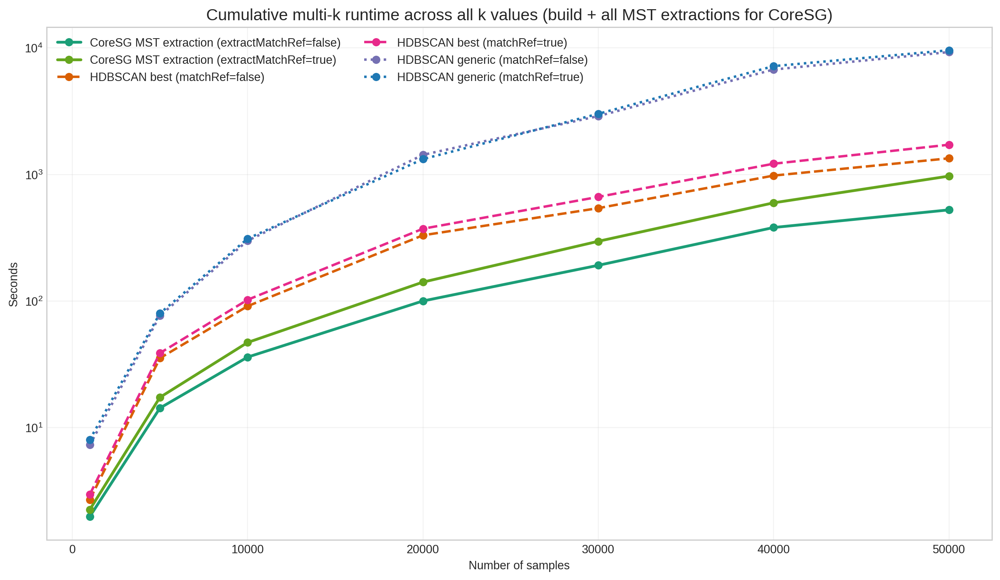
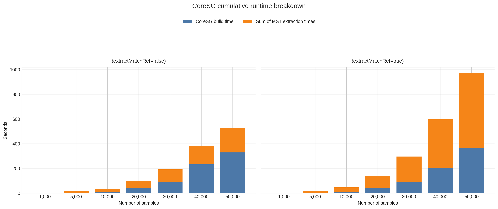

# CoreSG versus HDBSCAN for Repeated Multi-k Hierarchy Extraction

## Abstract

This report evaluates CoreSG and HDBSCAN on a repeated multi-`k` clustering workflow in which hierarchies are required for all `k` values from `50` down to `2`. The main question is whether the reusable CoreSG construction cost is amortized when many minimum spanning tree (MST) extractions are needed. Across all tested dataset sizes, the best CoreSG configuration outperforms the best HDBSCAN baseline in cumulative runtime, with reductions ranging from **26.4% to 69.7%** and speedups from **1.36x** to **3.30x**. The strongest benefits appear in larger datasets and against the generic HDBSCAN variants, where the cumulative gap becomes very large. In the per-`k` view, the first CoreSG point at `k=50` is now explicitly charged with the graph construction cost, since the first usable hierarchy necessarily includes that build step.

## 1. Introduction

CoreSG is intended for workflows in which a single graph structure is built once and then reused to extract MSTs and hierarchy artifacts for many `k` values. This is a different performance target from classical HDBSCAN execution, where the algorithm is rerun independently for each `k`. The experiments studied here therefore focus on cumulative runtime over a descending sequence of `k` values, rather than on single-run performance alone.

The central hypothesis is that CoreSG pays a higher up-front construction cost, but compensates for it through cheap repeated MST extractions. If that tradeoff holds, CoreSG should provide lower cumulative runtime than HDBSCAN in repeated multi-`k` analysis.

## 2. Experimental Design

### 2.1 Datasets and Parameters

The CSV files in [`benchmarking/`](./) cover synthetic datasets with the following settings:

- `n_samples` in `{1000, 5000, 10000, 20000, 30000, 40000, 50000}`
- `n_features = 20`
- `centers = 10`
- `seed = 42`
- `k` values from `50` down to `2` (`49` values)
- `30` repetitions per configuration

### 2.2 Compared Methods

The benchmark includes:

- `CoreSG_fitMatchRef_true_extractMatchRef_false`
- `CoreSG_fitMatchRef_true_extractMatchRef_true`
- `HDBSCAN_algorithm_best_matchRef_false`
- `HDBSCAN_algorithm_best_matchRef_true`
- `HDBSCAN_algorithm_generic_matchRef_false`
- `HDBSCAN_algorithm_generic_matchRef_true`

### 2.3 Runtime Measures

Two complementary runtime views are used throughout this report:

1. **Per-k runtime comparison**.
   For CoreSG, this uses **`fit_seconds + extract_seconds` at `k = k_max`** and **MST extraction time only** for smaller `k`.
   For HDBSCAN, this uses the **full execution time**.

2. **Cumulative runtime comparison**.
   For CoreSG, the cumulative mean is recomputed as:
   `CoreSG cumulative mean = CoreSG build mean + sum of MST extraction means`
   For HDBSCAN, the cumulative mean is the sum of full execution means across all `k`.

This distinction is important because summing the `total_seconds` column directly for CoreSG would incorrectly count the build phase once for every `k`.

### 2.4 Reporting Conventions

All summary tables report results in a `mean ± std` style commonly used in empirical computer science papers. Because the CSV files already contain aggregated statistics per `k`, the cumulative standard deviation is reconstructed by variance propagation, i.e. by taking the square root of the sum of squared standard deviations. This is an approximation, but it is the most defensible estimate that can be derived from the available benchmark outputs.

## 3. Results

### 3.1 Best-Configuration Summary

The fastest CoreSG configuration is consistently **`extractMatchRef=false`**, and the fastest HDBSCAN baseline is consistently **`best, matchRef=false`**.

| Samples | Best CoreSG configuration | CoreSG cumulative mean ± std (s) | Best HDBSCAN configuration | HDBSCAN cumulative mean ± std (s) | Speedup | Runtime reduction |
| --- | --- | --- | --- | --- | --- | --- |
| 1000 | CoreSG MST extraction (extractMatchRef=false) | 1.98 ± 0.01 | HDBSCAN best (matchRef=false) | 2.70 ± 0.01 | 1.36x | 26.4% |
| 5000 | CoreSG MST extraction (extractMatchRef=false) | 14.29 ± 0.03 | HDBSCAN best (matchRef=false) | 35.43 ± 0.04 | 2.48x | 59.7% |
| 10000 | CoreSG MST extraction (extractMatchRef=false) | 36.11 ± 0.04 | HDBSCAN best (matchRef=false) | 91.22 ± 0.08 | 2.53x | 60.4% |
| 20000 | CoreSG MST extraction (extractMatchRef=false) | 100.21 ± 0.16 | HDBSCAN best (matchRef=false) | 331.03 ± 0.54 | 3.30x | 69.7% |
| 30000 | CoreSG MST extraction (extractMatchRef=false) | 191.72 ± 0.49 | HDBSCAN best (matchRef=false) | 542.19 ± 0.65 | 2.83x | 64.6% |
| 40000 | CoreSG MST extraction (extractMatchRef=false) | 381.33 ± 24.86 | HDBSCAN best (matchRef=false) | 980.50 ± 10.10 | 2.57x | 61.1% |
| 50000 | CoreSG MST extraction (extractMatchRef=false) | 525.45 ± 34.21 | HDBSCAN best (matchRef=false) | 1342.44 ± 16.98 | 2.55x | 60.9% |

These results show that CoreSG already becomes advantageous at `n=1000` and that the cumulative advantage generally increases with dataset size. The most favorable point against the best HDBSCAN baseline occurs at `n=20000`, where CoreSG reaches **3.30x** speedup and **69.7%** cumulative runtime reduction.

### 3.2 Per-k Runtime Trends

Figure 1 compares **CoreSG runtime per requested `k`** with **full HDBSCAN execution time** for each value of `k`. For readability, the curves are built using a subsampling of the benchmark results in steps of five `k` units, while preserving both endpoints (`k=50` and `k=2`). For CoreSG, the point at `k=50` includes the graph construction cost (`fit_seconds`) because that first result cannot be obtained without building the support graph. For all subsequent `k` values, the plotted time corresponds only to MST extraction. The x-axis is intentionally displayed from the largest `k` to the smallest `k`, and the y-axis uses a **symmetric logarithmic scale** so that the initial CoreSG build cost remains visible without flattening the lower extraction costs.

The figure shows a stable pattern. At `k=50`, the CoreSG curve starts with the full cost of construction plus extraction, which is the correct cost for producing the first hierarchy. After that initial point, the CoreSG runtime drops sharply because the expensive construction phase has already been paid. As `k` decreases, CoreSG extraction remains comparatively cheap, whereas HDBSCAN continues to pay the cost of a full execution at every step. This separation becomes especially clear for larger datasets, where all HDBSCAN curves move upward while the post-build CoreSG extraction costs remain in a much lower time band.

### 3.3 Cumulative Runtime Scaling

Figure 2 shows the cumulative mean runtime required to complete the entire multi-`k` experiment. This is the main metric for evaluating the intended CoreSG use case.

The cumulative curves confirm that the one-time CoreSG construction cost is amortized by repeated reuse. Even though CoreSG pays a larger up-front cost than a single MST extraction, the total cost over all `49` values of `k` remains substantially lower than repeated HDBSCAN executions. At `n=40000`, for instance, the best CoreSG configuration completes the whole workload in **381.33 s**, compared with **980.50 s** for the best HDBSCAN baseline.

### 3.4 CoreSG Cost Decomposition

Figure 3 decomposes the cumulative CoreSG cost into the one-time graph build and the sum of MST extraction costs.

The figure indicates that the build stage dominates CoreSG cost, which is expected because it constructs the reusable support graph. Nevertheless, the aggregate extraction cost remains small enough that the overall cumulative cost stays favorable. The `extractMatchRef=false` configuration is systematically better than `extractMatchRef=true`, and the gap widens as the dataset size grows.

### 3.5 Pairwise Speedup Matrix

Figure 4 reports the speedup of the fastest CoreSG configuration over each HDBSCAN variant.

The heatmap reinforces two conclusions. First, CoreSG is faster than every HDBSCAN variant in the repeated multi-`k` scenario. Second, the largest gains occur against the generic HDBSCAN variants, where the cumulative execution penalty is especially high. On average, `HDBSCAN generic (matchRef=false)` is about **4.52x** slower than `HDBSCAN best (matchRef=false)` even before considering the additional CoreSG advantage.

## 4. Detailed Pairwise Analysis

This section compares the best CoreSG configuration, **CoreSG MST extraction (`extractMatchRef=false`)**, against every other method individually. Each table reports cumulative mean runtime, cumulative standard deviation, absolute time gap, speedup, and runtime reduction.

### Best CoreSG vs. CoreSG MST extraction (extractMatchRef=true)

| Samples | CoreSG mean (s) | CoreSG std (s) | Compared method | Method mean (s) | Method std (s) | Absolute gap (s) | Speedup | Runtime reduction (%) |
| --- | --- | --- | --- | --- | --- | --- | --- | --- |
| 1000 | 1.98 | 0.01 | CoreSG MST extraction (extractMatchRef=true) | 2.25 | 0.01 | 0.27 | 1.14x | 11.9% |
| 5000 | 14.29 | 0.03 | CoreSG MST extraction (extractMatchRef=true) | 17.36 | 0.02 | 3.07 | 1.21x | 17.7% |
| 10000 | 36.11 | 0.04 | CoreSG MST extraction (extractMatchRef=true) | 47.11 | 0.06 | 11.00 | 1.30x | 23.4% |
| 20000 | 100.21 | 0.16 | CoreSG MST extraction (extractMatchRef=true) | 141.25 | 0.23 | 41.04 | 1.41x | 29.1% |
| 30000 | 191.72 | 0.49 | CoreSG MST extraction (extractMatchRef=true) | 296.81 | 1.65 | 105.09 | 1.55x | 35.4% |
| 40000 | 381.33 | 24.86 | CoreSG MST extraction (extractMatchRef=true) | 597.55 | 19.58 | 216.23 | 1.57x | 36.2% |
| 50000 | 525.45 | 34.21 | CoreSG MST extraction (extractMatchRef=true) | 971.22 | 41.82 | 445.78 | 1.85x | 45.9% |

CoreSG is faster than **CoreSG MST extraction (extractMatchRef=true)** for every tested dataset size. The advantage ranges from **1.14x** at `n=1000` to **1.85x** at `n=50000`. In absolute terms, the largest time gap appears at `n=50000`, where CoreSG saves **445.78 s** over the full multi-`k` experiment.

### Best CoreSG vs. HDBSCAN best (matchRef=false)

| Samples | CoreSG mean (s) | CoreSG std (s) | Compared method | Method mean (s) | Method std (s) | Absolute gap (s) | Speedup | Runtime reduction (%) |
| --- | --- | --- | --- | --- | --- | --- | --- | --- |
| 1000 | 1.98 | 0.01 | HDBSCAN best (matchRef=false) | 2.70 | 0.01 | 0.71 | 1.36x | 26.4% |
| 5000 | 14.29 | 0.03 | HDBSCAN best (matchRef=false) | 35.43 | 0.04 | 21.14 | 2.48x | 59.7% |
| 10000 | 36.11 | 0.04 | HDBSCAN best (matchRef=false) | 91.22 | 0.08 | 55.11 | 2.53x | 60.4% |
| 20000 | 100.21 | 0.16 | HDBSCAN best (matchRef=false) | 331.03 | 0.54 | 230.81 | 3.30x | 69.7% |
| 30000 | 191.72 | 0.49 | HDBSCAN best (matchRef=false) | 542.19 | 0.65 | 350.48 | 2.83x | 64.6% |
| 40000 | 381.33 | 24.86 | HDBSCAN best (matchRef=false) | 980.50 | 10.10 | 599.18 | 2.57x | 61.1% |
| 50000 | 525.45 | 34.21 | HDBSCAN best (matchRef=false) | 1342.44 | 16.98 | 817.00 | 2.55x | 60.9% |

CoreSG is faster than **HDBSCAN best (matchRef=false)** for every tested dataset size. The advantage ranges from **1.36x** at `n=1000` to **3.30x** at `n=20000`. In absolute terms, the largest time gap appears at `n=50000`, where CoreSG saves **817.00 s** over the full multi-`k` experiment.

### Best CoreSG vs. HDBSCAN best (matchRef=true)

| Samples | CoreSG mean (s) | CoreSG std (s) | Compared method | Method mean (s) | Method std (s) | Absolute gap (s) | Speedup | Runtime reduction (%) |
| --- | --- | --- | --- | --- | --- | --- | --- | --- |
| 1000 | 1.98 | 0.01 | HDBSCAN best (matchRef=true) | 2.97 | 0.01 | 0.98 | 1.49x | 33.1% |
| 5000 | 14.29 | 0.03 | HDBSCAN best (matchRef=true) | 38.85 | 0.04 | 24.56 | 2.72x | 63.2% |
| 10000 | 36.11 | 0.04 | HDBSCAN best (matchRef=true) | 102.44 | 0.09 | 66.33 | 2.84x | 64.7% |
| 20000 | 100.21 | 0.16 | HDBSCAN best (matchRef=true) | 372.93 | 0.57 | 272.71 | 3.72x | 73.1% |
| 30000 | 191.72 | 0.49 | HDBSCAN best (matchRef=true) | 665.30 | 8.97 | 473.58 | 3.47x | 71.2% |
| 40000 | 381.33 | 24.86 | HDBSCAN best (matchRef=true) | 1216.81 | 2.46 | 835.48 | 3.19x | 68.7% |
| 50000 | 525.45 | 34.21 | HDBSCAN best (matchRef=true) | 1718.93 | 3.90 | 1193.48 | 3.27x | 69.4% |

CoreSG is faster than **HDBSCAN best (matchRef=true)** for every tested dataset size. The advantage ranges from **1.49x** at `n=1000` to **3.72x** at `n=20000`. In absolute terms, the largest time gap appears at `n=50000`, where CoreSG saves **1193.48 s** over the full multi-`k` experiment.

### Best CoreSG vs. HDBSCAN generic (matchRef=false)

| Samples | CoreSG mean (s) | CoreSG std (s) | Compared method | Method mean (s) | Method std (s) | Absolute gap (s) | Speedup | Runtime reduction (%) |
| --- | --- | --- | --- | --- | --- | --- | --- | --- |
| 1000 | 1.98 | 0.01 | HDBSCAN generic (matchRef=false) | 7.31 | 0.00 | 5.32 | 3.68x | 72.8% |
| 5000 | 14.29 | 0.03 | HDBSCAN generic (matchRef=false) | 76.68 | 0.05 | 62.39 | 5.36x | 81.4% |
| 10000 | 36.11 | 0.04 | HDBSCAN generic (matchRef=false) | 299.81 | 0.26 | 263.69 | 8.30x | 88.0% |
| 20000 | 100.21 | 0.16 | HDBSCAN generic (matchRef=false) | 1429.84 | 30.68 | 1329.62 | 14.27x | 93.0% |
| 30000 | 191.72 | 0.49 | HDBSCAN generic (matchRef=false) | 2894.76 | 3.89 | 2703.04 | 15.10x | 93.4% |
| 40000 | 381.33 | 24.86 | HDBSCAN generic (matchRef=false) | 6747.33 | 17.73 | 6366.01 | 17.69x | 94.3% |
| 50000 | 525.45 | 34.21 | HDBSCAN generic (matchRef=false) | 9272.92 | 23.85 | 8747.47 | 17.65x | 94.3% |

CoreSG is faster than **HDBSCAN generic (matchRef=false)** for every tested dataset size. The advantage ranges from **3.68x** at `n=1000` to **17.69x** at `n=40000`. In absolute terms, the largest time gap appears at `n=50000`, where CoreSG saves **8747.47 s** over the full multi-`k` experiment.

### Best CoreSG vs. HDBSCAN generic (matchRef=true)

| Samples | CoreSG mean (s) | CoreSG std (s) | Compared method | Method mean (s) | Method std (s) | Absolute gap (s) | Speedup | Runtime reduction (%) |
| --- | --- | --- | --- | --- | --- | --- | --- | --- |
| 1000 | 1.98 | 0.01 | HDBSCAN generic (matchRef=true) | 8.04 | 0.01 | 6.06 | 4.05x | 75.3% |
| 5000 | 14.29 | 0.03 | HDBSCAN generic (matchRef=true) | 80.07 | 0.07 | 65.78 | 5.60x | 82.1% |
| 10000 | 36.11 | 0.04 | HDBSCAN generic (matchRef=true) | 311.31 | 0.29 | 275.20 | 8.62x | 88.4% |
| 20000 | 100.21 | 0.16 | HDBSCAN generic (matchRef=true) | 1323.41 | 1.18 | 1223.20 | 13.21x | 92.4% |
| 30000 | 191.72 | 0.49 | HDBSCAN generic (matchRef=true) | 3015.08 | 17.94 | 2823.37 | 15.73x | 93.6% |
| 40000 | 381.33 | 24.86 | HDBSCAN generic (matchRef=true) | 7181.05 | 51.97 | 6799.72 | 18.83x | 94.7% |
| 50000 | 525.45 | 34.21 | HDBSCAN generic (matchRef=true) | 9580.93 | 60.08 | 9055.48 | 18.23x | 94.5% |

CoreSG is faster than **HDBSCAN generic (matchRef=true)** for every tested dataset size. The advantage ranges from **4.05x** at `n=1000` to **18.83x** at `n=40000`. In absolute terms, the largest time gap appears at `n=50000`, where CoreSG saves **9055.48 s** over the full multi-`k` experiment.

## 5. Full Cumulative Statistics

| Samples | Method | CoreSG build mean (s) | CoreSG build std (s) | MST extraction sum mean (s) | MST extraction sum std (s) | Cumulative mean (s) | Cumulative std (s) | k values |
| --- | --- | --- | --- | --- | --- | --- | --- | --- |
| 1000 | CoreSG MST extraction (extractMatchRef=false) | 0.21 | 0.01 | 1.78 | 0.01 | 1.98 | 0.01 | 49 |
| 1000 | CoreSG MST extraction (extractMatchRef=true) | 0.21 | 0.01 | 2.05 | 0.00 | 2.25 | 0.01 | 49 |
| 1000 | HDBSCAN best (matchRef=false) | - | - | - | - | 2.70 | 0.01 | 49 |
| 1000 | HDBSCAN best (matchRef=true) | - | - | - | - | 2.97 | 0.01 | 49 |
| 1000 | HDBSCAN generic (matchRef=false) | - | - | - | - | 7.31 | 0.00 | 49 |
| 1000 | HDBSCAN generic (matchRef=true) | - | - | - | - | 8.04 | 0.01 | 49 |
| 5000 | CoreSG MST extraction (extractMatchRef=false) | 2.49 | 0.01 | 11.81 | 0.02 | 14.29 | 0.03 | 49 |
| 5000 | CoreSG MST extraction (extractMatchRef=true) | 2.49 | 0.01 | 14.87 | 0.02 | 17.36 | 0.02 | 49 |
| 5000 | HDBSCAN best (matchRef=false) | - | - | - | - | 35.43 | 0.04 | 49 |
| 5000 | HDBSCAN best (matchRef=true) | - | - | - | - | 38.85 | 0.04 | 49 |
| 5000 | HDBSCAN generic (matchRef=false) | - | - | - | - | 76.68 | 0.05 | 49 |
| 5000 | HDBSCAN generic (matchRef=true) | - | - | - | - | 80.07 | 0.07 | 49 |
| 10000 | CoreSG MST extraction (extractMatchRef=false) | 9.55 | 0.04 | 26.56 | 0.02 | 36.11 | 0.04 | 49 |
| 10000 | CoreSG MST extraction (extractMatchRef=true) | 9.58 | 0.05 | 37.53 | 0.04 | 47.11 | 0.06 | 49 |
| 10000 | HDBSCAN best (matchRef=false) | - | - | - | - | 91.22 | 0.08 | 49 |
| 10000 | HDBSCAN best (matchRef=true) | - | - | - | - | 102.44 | 0.09 | 49 |
| 10000 | HDBSCAN generic (matchRef=false) | - | - | - | - | 299.81 | 0.26 | 49 |
| 10000 | HDBSCAN generic (matchRef=true) | - | - | - | - | 311.31 | 0.29 | 49 |
| 20000 | CoreSG MST extraction (extractMatchRef=false) | 39.20 | 0.16 | 61.01 | 0.04 | 100.21 | 0.16 | 49 |
| 20000 | CoreSG MST extraction (extractMatchRef=true) | 39.31 | 0.19 | 101.94 | 0.12 | 141.25 | 0.23 | 49 |
| 20000 | HDBSCAN best (matchRef=false) | - | - | - | - | 331.03 | 0.54 | 49 |
| 20000 | HDBSCAN best (matchRef=true) | - | - | - | - | 372.93 | 0.57 | 49 |
| 20000 | HDBSCAN generic (matchRef=false) | - | - | - | - | 1429.84 | 30.68 | 49 |
| 20000 | HDBSCAN generic (matchRef=true) | - | - | - | - | 1323.41 | 1.18 | 49 |
| 30000 | CoreSG MST extraction (extractMatchRef=false) | 88.41 | 0.48 | 103.30 | 0.08 | 191.72 | 0.49 | 49 |
| 30000 | CoreSG MST extraction (extractMatchRef=true) | 88.65 | 1.56 | 208.16 | 0.54 | 296.81 | 1.65 | 49 |
| 30000 | HDBSCAN best (matchRef=false) | - | - | - | - | 542.19 | 0.65 | 49 |
| 30000 | HDBSCAN best (matchRef=true) | - | - | - | - | 665.30 | 8.97 | 49 |
| 30000 | HDBSCAN generic (matchRef=false) | - | - | - | - | 2894.76 | 3.89 | 49 |
| 30000 | HDBSCAN generic (matchRef=true) | - | - | - | - | 3015.08 | 17.94 | 49 |
| 40000 | CoreSG MST extraction (extractMatchRef=false) | 232.82 | 24.86 | 148.50 | 0.44 | 381.33 | 24.86 | 49 |
| 40000 | CoreSG MST extraction (extractMatchRef=true) | 205.50 | 19.48 | 392.06 | 1.98 | 597.55 | 19.58 | 49 |
| 40000 | HDBSCAN best (matchRef=false) | - | - | - | - | 980.50 | 10.10 | 49 |
| 40000 | HDBSCAN best (matchRef=true) | - | - | - | - | 1216.81 | 2.46 | 49 |
| 40000 | HDBSCAN generic (matchRef=false) | - | - | - | - | 6747.33 | 17.73 | 49 |
| 40000 | HDBSCAN generic (matchRef=true) | - | - | - | - | 7181.05 | 51.97 | 49 |
| 50000 | CoreSG MST extraction (extractMatchRef=false) | 329.61 | 34.21 | 195.84 | 0.26 | 525.45 | 34.21 | 49 |
| 50000 | CoreSG MST extraction (extractMatchRef=true) | 367.84 | 41.70 | 603.39 | 3.19 | 971.22 | 41.82 | 49 |
| 50000 | HDBSCAN best (matchRef=false) | - | - | - | - | 1342.44 | 16.98 | 49 |
| 50000 | HDBSCAN best (matchRef=true) | - | - | - | - | 1718.93 | 3.90 | 49 |
| 50000 | HDBSCAN generic (matchRef=false) | - | - | - | - | 9272.92 | 23.85 | 49 |
| 50000 | HDBSCAN generic (matchRef=true) | - | - | - | - | 9580.93 | 60.08 | 49 |

The table above makes the `mean ± std` reporting explicit for both the cumulative totals and, where applicable, the two internal CoreSG components: build cost and total MST extraction cost.

## 6. Discussion

Taken together, the results strongly support the original CoreSG design rationale. The method is not optimized for a single isolated `k`, but for a sequence of related hierarchy extractions over many `k` values. Under that workload, CoreSG consistently dominates HDBSCAN because it converts repeated expensive recomputation into one reusable build plus many inexpensive extraction steps.

The pairwise comparisons are also important methodologically. CoreSG does not merely outperform the weakest baselines. It remains ahead of the strongest HDBSCAN baseline across every tested dataset size, and its advantage becomes especially pronounced as scale increases. This suggests that the reuse strategy is not a marginal optimization; it changes the practical runtime regime of the whole multi-`k` workflow.

## 7. Threats to Validity

Some limitations should be acknowledged:

- The datasets are synthetic, so the absolute timings may differ on real-world distributions.
- The cumulative standard deviations are reconstructed from aggregated per-`k` summaries rather than from raw repetition-level traces.
- The experiments keep `n_features`, `centers`, and `k_max` fixed, so the conclusions are strongest for this benchmark shape.
- The study measures runtime only; memory consumption and downstream clustering quality are outside the scope of this report.

These limitations do not invalidate the observed trend, but they do define the boundary of what can be claimed directly from the current benchmark suite.

## 8. Conclusion

The experimental evidence consistently indicates that CoreSG is the preferable runtime strategy for repeated multi-`k` hierarchy extraction. Its best configuration, **CoreSG MST extraction (`extractMatchRef=false`)**, outperforms every HDBSCAN variant tested here, including the strongest `best, matchRef=false` baseline. The performance gains are already visible at small scale and become substantial for larger datasets.

For one-off analyses at a single `k`, plain HDBSCAN may still be attractive because it avoids the CoreSG build phase. For the benchmarked workload, however, the cumulative evidence is clear: reusable graph construction plus repeated MST extraction is a more efficient execution model than rerunning HDBSCAN independently for every `k`.
