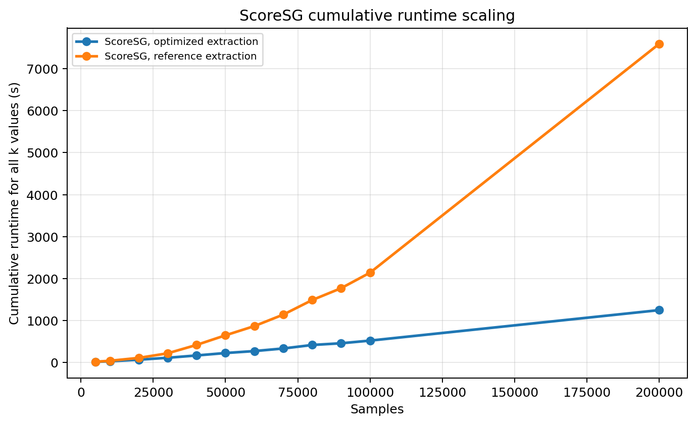

Scaling
=======

ScoreSG scaling results
-----------------------

ScoreSG is the strongest scaling result in the current benchmark suite. It is
the approximate path intended to relieve the exact CoreSG ``n_samples``
limitation caused by dense pairwise distance construction.

In the common interval where ScoreSG, exact CoreSG, and HDBSCAN are all
available, optimized ScoreSG has the lowest empirical growth exponent and the
lowest cumulative runtime.

.. list-table:: Empirical cumulative-runtime scaling in the common interval
   :header-rows: 1

   * - Method
     - Empirical exponent
     - Interpretation
   * - ScoreSG, optimized extraction
     - ``1.247``
     - Best observed scaling profile.
   * - Exact CoreSG, optimized extraction
     - ``1.575``
     - Reuse helps, but dense construction remains costly.
   * - HDBSCAN ``best``, optimized
     - ``1.601``
     - Strong HDBSCAN baseline, still recomputed for every ``k``.
   * - HDBSCAN ``generic``, optimized
     - ``2.113``
     - Near-quadratic cumulative behavior in the benchmark.

At ``N=50,000``, optimized ScoreSG completes the full ``49``-value workload in
``224.36 s``. The corresponding runtimes are ``525.45 s`` for optimized exact
CoreSG, ``1,342.44 s`` for optimized HDBSCAN ``best``, and ``9,272.92 s`` for
optimized HDBSCAN ``generic``. This means the approximate ScoreSG path is not
only faster at one point; it also grows more slowly as ``N`` increases.

The ScoreSG-only extended benchmark reaches ``N=200,000`` samples. In that
range, optimized ScoreSG keeps an empirical exponent near ``1.26`` and reaches
``1,246.93 s`` cumulative runtime at ``N=200,000``. The same run decomposes
into ``54.92 s`` of construction and ``1,192.01 s`` of cumulative extraction,
showing that after many requested ``k`` values the extraction phase dominates
the total cost.

The reference extraction path is much less scalable. At ``N=200,000``, it
reaches ``7,592.37 s``, approximately ``6.09x`` slower than optimized ScoreSG.
This is an important implementation insight: the approximate graph
construction is necessary, but the optimized extraction routine is also
essential for preserving the favorable scaling behavior.

Exact CoreSG scaling baseline
-----------------------------

.. image:: ../_static/images/benchmarks/coresg_runtime_breakdown.png
   :alt: Core-SG runtime breakdown

Core-SG scaling depends on the cost of support graph construction and the cost
of repeated MST extraction.

The build stage typically dominates cumulative Core-SG cost. The value of the
method comes from avoiding repeated full builds for every target ``k``.

Score-SG is designed to avoid explicit dense all-pairs distance construction,
but it should still be interpreted empirically because approximate nearest
neighbor behavior depends on data geometry, metric choice, and PyNNDescent
parameters.

In the current benchmark suite, ScoreSG with optimized extraction shows the
most favorable scaling profile among the measured methods. Over the common
comparison interval, the cumulative runtime grows approximately as
``O(N^1.25)``. By contrast, optimized HDBSCAN ``best`` grows around
``O(N^1.60)`` and optimized HDBSCAN ``generic`` grows around ``O(N^2.11)``.
The ScoreSG-only extended benchmark up to ``N=200,000`` keeps a similar
empirical exponent, approximately ``1.26``.

See :doc:`score_sg_results` for the ScoreSG tables and figures.
