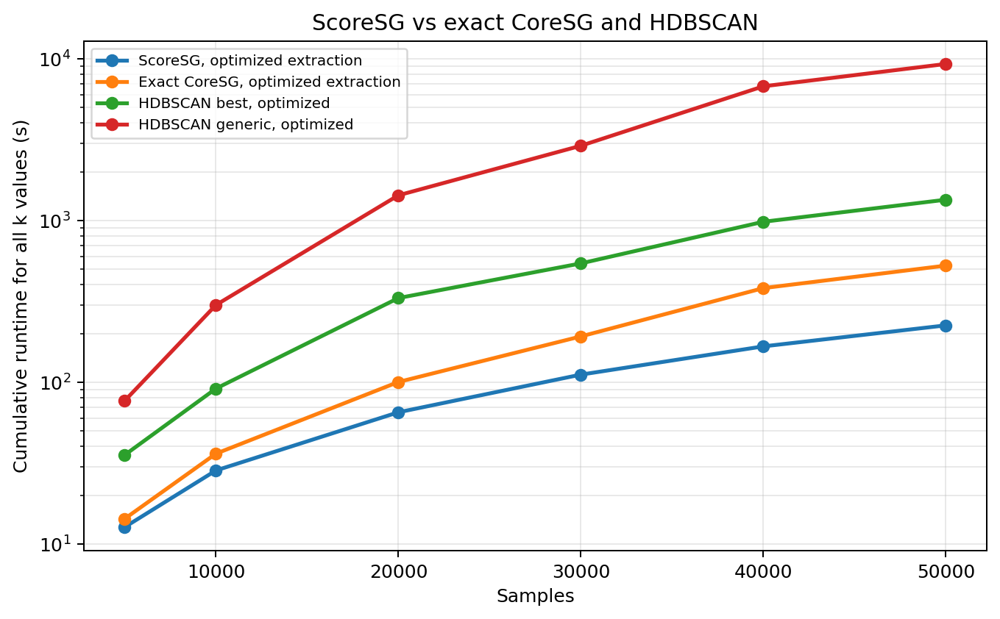

ScoreSG Performance Results
===========================

ScoreSG is the approximate graph-construction path of Core-SG. It is designed
for the same repeated multi-``k`` workflow, but it avoids the most expensive
exact construction steps by using approximate neighbor discovery and a lighter
support graph. In the benchmark data currently available in this repository,
ScoreSG is represented by the ``core_sg_cython_*.csv`` result files.

This page should be read as the main performance evidence for overcoming the
traditional exact CoreSG ``n_samples`` limitation. Exact CoreSG reuses work
across ``k`` values, but it still depends on dense pairwise distance
information. ScoreSG is the scalable approximate path intended for cases where
that dense construction becomes the bottleneck.

The main performance question is whether the approximate construction changes
the cumulative runtime regime when many hierarchy extractions are required for
the same dataset. The answer is yes in the tested workload: ScoreSG with
optimized extraction is the fastest method in every dataset size where it can
be compared directly against exact CoreSG and HDBSCAN.

Common comparison interval
--------------------------

The following figure compares cumulative runtime for the common interval in
which ScoreSG, exact CoreSG, and HDBSCAN measurements are all available
(``N=5,000`` through ``N=50,000``).

The cumulative runtime is reconstructed as build once plus all extraction
times for CoreSG and ScoreSG, and as the sum of independent executions for
HDBSCAN. This distinction is essential: ScoreSG and CoreSG are intended to
reuse support across many values of ``k``, while HDBSCAN is rerun for each
target value.

At ``N=50,000``, optimized ScoreSG completes the full ``49``-value multi-``k``
workflow in **224.36 s**. The corresponding cumulative runtimes are
**525.45 s** for optimized exact CoreSG, **1,342.44 s** for optimized HDBSCAN
``best``, and **9,272.92 s** for optimized HDBSCAN ``generic``. Thus, at the
largest directly comparable sample size, ScoreSG is approximately **2.34x**
faster than exact CoreSG, **5.98x** faster than HDBSCAN ``best``, and
**41.33x** faster than HDBSCAN ``generic``.

.. list-table:: Cumulative runtime in seconds for the common interval
   :header-rows: 1

   * - Method
     - 5,000
     - 10,000
     - 20,000
     - 30,000
     - 40,000
     - 50,000
   * - ScoreSG, optimized extraction
     - 12.69
     - 28.44
     - 65.10
     - 111.28
     - 166.37
     - 224.36
   * - Exact CoreSG, optimized extraction
     - 14.29
     - 36.11
     - 100.21
     - 191.72
     - 381.33
     - 525.45
   * - HDBSCAN ``best``, optimized
     - 35.43
     - 91.22
     - 331.03
     - 542.19
     - 980.50
     - 1,342.44
   * - HDBSCAN ``generic``, optimized
     - 76.68
     - 299.81
     - 1,429.84
     - 2,894.76
     - 6,747.33
     - 9,272.92

Scaling of the approximate path
-------------------------------

The ScoreSG benchmark extends beyond the common interval and reaches
``N=200,000`` samples. This larger range should be interpreted as a ScoreSG-only
scaling study, because equivalent HDBSCAN and exact CoreSG measurements are not
available for the same sample sizes.

.. image:: ../_static/images/benchmarks/score_sg_extended_runtime.png
   :alt: ScoreSG cumulative runtime up to 200,000 samples

For optimized ScoreSG, cumulative runtime grows from **12.69 s** at
``N=5,000`` to **1,246.93 s** at ``N=200,000``. A log-log power-law fit over
this interval gives an empirical exponent of approximately ``1.26`` for total
runtime. The reference extraction path grows much more quickly, with an
empirical exponent close to ``1.70``.

The difference between the two ScoreSG extraction paths widens with sample
size. The reference extraction path is **1.28x** slower at ``N=5,000`` but
**6.09x** slower at ``N=200,000``. This indicates that the approximate graph
construction alone is not the full story: the optimized extraction routine is
also necessary to preserve the favorable scaling observed in the benchmark.

Interpretation
--------------

The main gain of ScoreSG comes from changing the cost structure of exploratory
analysis. HDBSCAN remains an important baseline, especially for single
executions, but in repeated multi-``k`` workflows it pays the full execution
cost for every target value. ScoreSG instead pays for a reusable construction
and then performs repeated extractions.

The measured results suggest three practical conclusions:

* ScoreSG is the best-performing option in the current repeated multi-``k``
  benchmark whenever optimized extraction is used.
* The approximate path provides increasing benefit as ``N`` grows, especially
  compared with HDBSCAN ``generic`` and repeated HDBSCAN ``best`` executions.
* For large workloads, extraction optimization matters as much as graph
  construction, because cumulative extraction dominates total runtime after
  many values of ``k`` are requested.

These results should still be read empirically. Approximate neighbor quality,
data geometry, metric choice, and PyNNDescent settings can affect both runtime
and clustering behavior. The current benchmark demonstrates a strong runtime
advantage for the tested synthetic workload; broader claims should be supported
by additional datasets and quality metrics.
